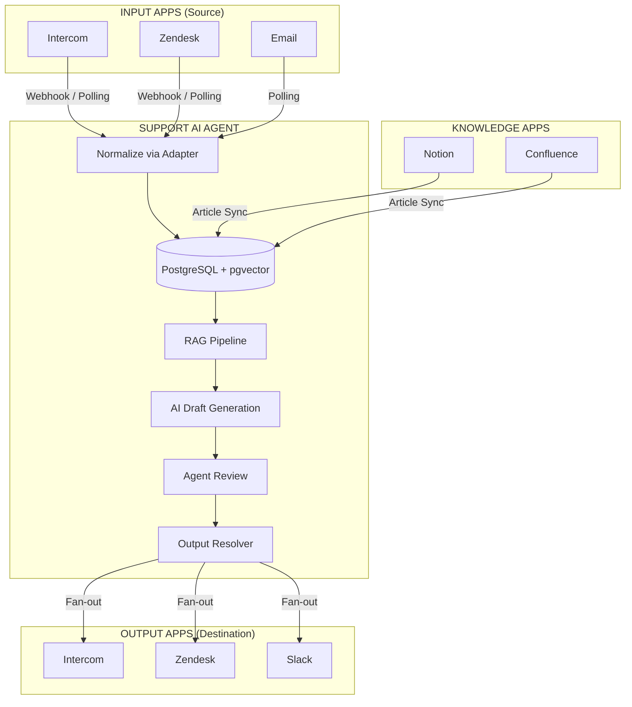
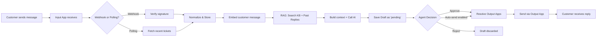
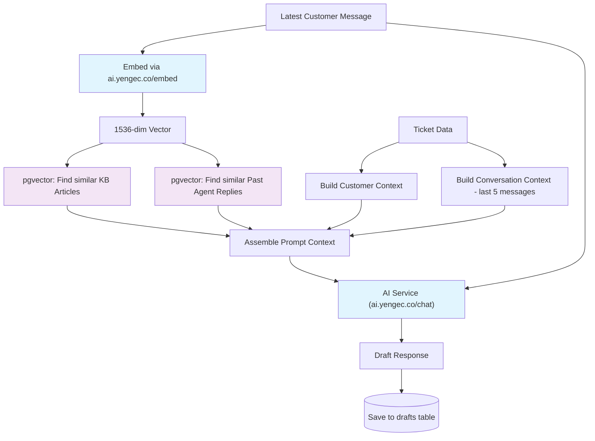
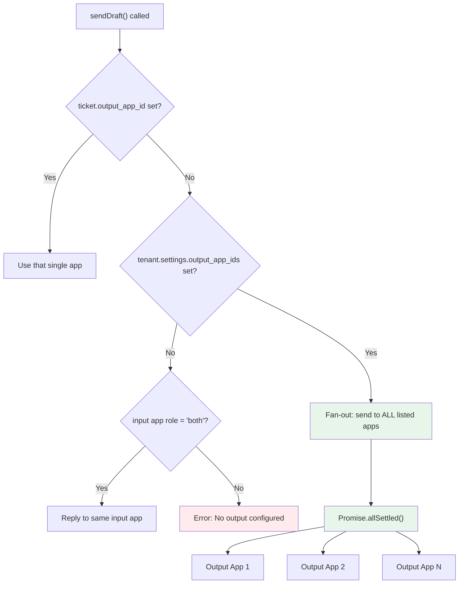
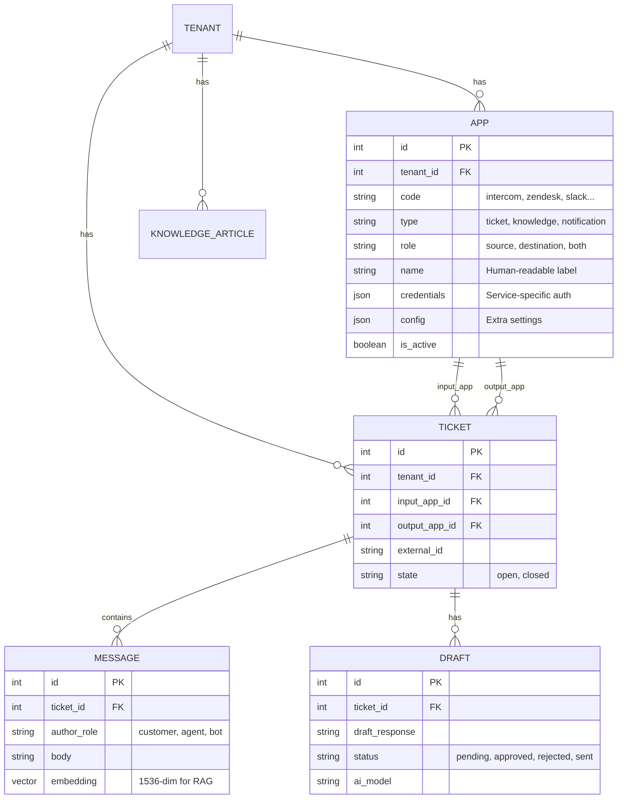

# Support AI Agent

Multi-tenant, app-based AI draft response microservice for customer support tickets. Uses **RAG (Retrieval-Augmented Generation)** with **pgvector** to generate context-aware draft replies personalized to each customer.

## Architecture

### System Overview



### Ticket Lifecycle



### RAG Pipeline Detail



### Output Routing (Fan-out)



### App Model



### Key Design Pillars

- **Multi-tenant** -- Every table is scoped by `tenant_id`. Data is never shared between tenants.
- **App-based I/O** -- Decoupled input/output with `InputApp` and `OutputApp` interfaces. A ticket from Intercom can have its reply sent to a different Zendesk instance.
- **Fan-out output** -- A single draft can be sent to multiple output apps in parallel via `resolveOutputApps()`.
- **Customer-aware** -- AI drafts are personalized using customer order history, previous tickets, and profile metadata.
- **Dual sync mode** -- Real-time webhooks + periodic polling (cron). No tickets are ever lost.

## App System

Apps are the core building block for connecting external services. Each app has three key properties:

| Property | Values | Description |
|----------|--------|-------------|
| **code** | `intercom`, `zendesk`, `slack`, `notion`... | Which service |
| **type** | `ticket`, `knowledge`, `notification` | What purpose |
| **role** | `source`, `destination`, `both` | Data direction |

Examples:
- Intercom (type: `ticket`, role: `both`) -- reads tickets AND sends replies
- Zendesk (type: `ticket`, role: `destination`) -- only receives replies
- Notion (type: `knowledge`, role: `source`) -- feeds the knowledge base
- Slack (type: `notification`, role: `destination`) -- receives notifications

A tenant can have multiple apps of the same code (e.g., two Intercom accounts).

### Interfaces

```typescript
// Input: reads tickets and handles webhooks
interface InputApp {
  fetchRecentTickets(sinceMinutes: number): Promise<NormalizedTicket[]>;
  fetchTicketMessages(externalTicketId: string): Promise<NormalizedMessage[]>;
  verifyWebhook(rawBody: Buffer, headers: Record<string, any>): boolean;
  parseWebhook(rawBody: Buffer, headers: Record<string, any>): WebhookEvent | null;
}

// Output: sends replies
interface OutputApp {
  sendReply(externalTicketId: string, body: string, options?: SendReplyOptions): Promise<void>;
}

// Knowledge: feeds the KB
interface KnowledgeSourceApp {
  fetchArticles(since?: Date): Promise<NormalizedArticle[]>;
}
```

### Output Routing (Fan-out)

When sending a draft, the system resolves which output app(s) to use:

1. **Ticket-level override** -- `ticket.output_app_id` is set → use that app
2. **Tenant pipeline** -- `tenant.settings.output_app_ids` array → send to all listed apps in parallel
3. **Fallback** -- Input app has `role: 'both'` → reply to same app
4. **Error** -- No output configured → throw error

Fan-out uses `Promise.allSettled()` -- one app failing doesn't block others.

### Supported Apps

| App | Type | Status | Webhook Verification |
|-----|------|--------|---------------------|
| Intercom | ticket | Implemented | HMAC-SHA1 (`X-Hub-Signature`) |
| Zendesk | ticket | Stub | -- |

### Adding a New App

1. Create `src/apps/<name>/<name>.app.ts` implementing `InputApp` and/or `OutputApp`
2. Create mapper + webhook + types files
3. Add case in `src/apps/app.factory.ts`
4. No changes needed anywhere else

## Tech Stack

- **Runtime**: Node.js 20+ / TypeScript
- **Framework**: Express.js
- **ORM**: Prisma
- **Database**: PostgreSQL 16 + pgvector
- **AI**: RAG pipeline via ai.yengec.co (`/embed` + `/chat`)
- **Testing**: Vitest + Supertest
- **Infra**: Docker, Kubernetes

## Quick Start

### Prerequisites

- Node.js >= 20
- Docker & Docker Compose

### Setup

```bash
# Clone
git clone https://github.com/salyangoz/support-ai-agent.git
cd support-ai-agent

# Start PostgreSQL with pgvector
docker-compose up -d db

# Install dependencies
npm install

# Configure environment
cp .env.example .env
# Edit .env with your settings

# Run database migrations
npm run migrate

# Generate Prisma client
npm run prisma:generate

# Start development server
npm run dev
```

The server starts on `http://localhost:3001`. Verify with:

```bash
curl http://localhost:3001/health
```

### Docker (full stack)

```bash
docker-compose up -d
```

This starts both the app (port 3001) and PostgreSQL with pgvector (port 5433).

## Environment Variables

| Variable | Description | Default |
|----------|-------------|---------|
| `PORT` | Server port | `3001` |
| `NODE_ENV` | Environment | `development` |
| `ADMIN_API_KEY` | Admin API key for tenant management | required |
| `DATABASE_URL` | PostgreSQL connection string | required |
| `YENGEC_AI_BASE_URL` | AI backend URL | `https://ai.yengec.co` |
| `LOG_LEVEL` | Winston log level | `info` |

All business configuration (AI model, RAG settings, tone, auto-send) is stored **per-tenant** in the database `tenants.settings` JSONB column -- not in environment variables.

## Tenant Settings

Stored in `tenants.settings` JSONB. New tenants work with zero configuration using these defaults:

| Setting | Default | Description |
|---------|---------|-------------|
| `auto_send_drafts` | `false` | Auto-send AI drafts without agent review |
| `default_language` | `en` | Language for AI responses |
| `rag_top_k` | `5` | Number of similar items to include in RAG context |
| `ai_service` | `deepseek` | AI service to use |
| `ai_model` | `deepseek-chat` | AI model to use |
| `ai_instructions` | `""` | Custom system instructions per tenant |
| `draft_tone` | `professional` | Tone: professional, friendly, formal |
| `max_context_tokens` | `4000` | Max tokens for RAG context |
| `sync_lookback_minutes` | `10` | Polling lookback window |
| `output_app_ids` | `[]` | Default output app IDs for fan-out delivery |

## Database

11 migrations run automatically on startup:

1. `001` -- Enable pgvector extension
2. `002` -- `tenants` (companies with API keys and settings)
3. `003` -- `tenant_providers` (legacy, removed in 011)
4. `004` -- `customers` (per-tenant, with metadata JSONB)
5. `005` -- `tickets` (linked to customers)
6. `006` -- `messages` (with `vector(1536)` embedding column)
7. `007` -- `knowledge_articles` (with `vector(1536)` embedding column)
8. `008` -- `drafts` (AI-generated, with approval workflow)
9. `009` -- `apps` (replaces tenant_providers: code, type, role, config)
10. `010` -- Add `input_app_id` / `output_app_id` to tickets
11. `011` -- Migrate data from tenant_providers to apps, drop old table

## Webhooks

Each app gets a unique webhook URL using its numeric ID:

```
POST /webhooks/:tenantSlug/:appId
```

Examples:
- `POST /webhooks/acme/1`
- `POST /webhooks/bigcorp/5`

Webhooks are verified using app-specific signatures (e.g., HMAC-SHA1 for Intercom) and processed asynchronously. The endpoint responds 200 immediately, then processes the event in the background.

## Scheduler

| Schedule | Job |
|----------|-----|
| `*/5 * * * *` | Sync all active tenants' input apps (polling) |
| `0 2 * * *` | Backfill missing embeddings |

## Testing

```bash
# Start test database
docker-compose up -d db-test

# Run all tests
npm test

# Run unit tests only (no DB required)
npm run test:unit

# Run feature tests only (requires test DB)
npm run test:feature
```

Unit tests: 41 passing (apps, services, middleware, utils).

## Kubernetes

Manifests in `k8s/`:

```bash
kubectl apply -f k8s/namespace.yaml
kubectl apply -f k8s/configmap.yaml
kubectl apply -f k8s/secret.yaml
kubectl apply -f k8s/deployment.yaml
kubectl apply -f k8s/service.yaml
kubectl apply -f k8s/hpa.yaml
kubectl apply -f k8s/ingress.yaml
```

- 2-10 replicas with HPA (70% CPU target)
- Health probes on `/health`
- TLS via cert-manager

## Project Structure

```
src/
  apps/             # App adapters (intercom/, zendesk/)
    app.interface.ts    # InputApp, OutputApp, DualApp, KnowledgeSourceApp
    app.factory.ts      # createInputApp(), createOutputApp()
    app.resolver.ts     # resolveOutputApps() with fan-out
    intercom/           # Intercom input + output implementations
    zendesk/            # Zendesk stubs
  config/           # Typed env config + tenant setting defaults
  controllers/      # Express request handlers
  database/         # Prisma client, migration runner, SQL migrations
  middleware/       # auth, webhookAuth, errorHandler
  models/           # TypeScript interfaces
  repositories/     # Prisma data access
  routes/           # Express router
  scheduler/        # node-cron jobs
  services/         # Business logic (RAG, sync, webhooks)
  utils/            # Logger, HTML-to-text, serializer
tests/
  unit/             # Pure logic tests (no DB)
  feature/          # Full request/response with real DB
  helpers/          # Test DB, fixtures, mock apps
k8s/                # Kubernetes manifests
```

## License

Proprietary -- Salyangoz Yazilim Ltd.
